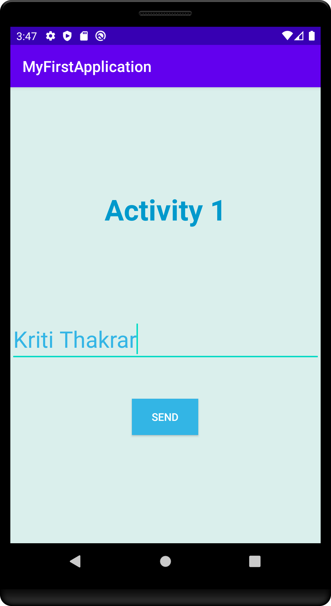
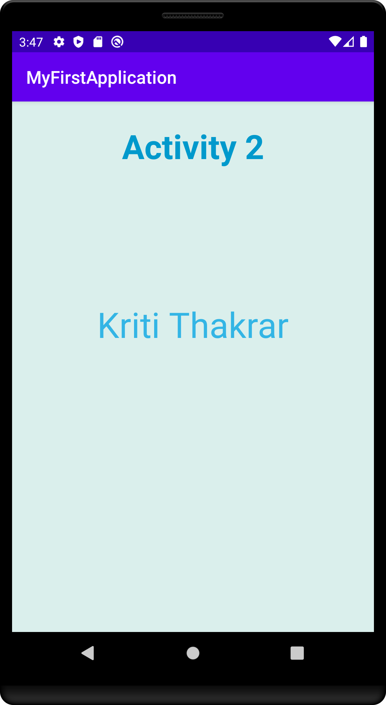

#  Mobile-Application-Development 

An aap which has two activities in which First activity contains an input message taken from user and the second actitivity displays the input message of the first activity.

## Final Result

<strong>Activity-1(Entering Data)</strong>

<strong>Activity-2(Displaying the entered data)</strong>

